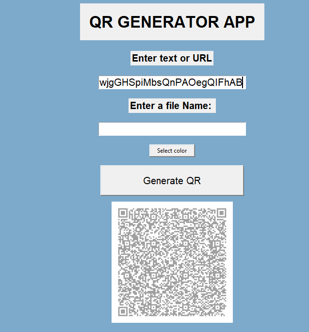

🔳 QR Generator App

A simple and modern GUI-based QR Code Generator built using Python and Tkinter.
This application allows users to generate QR codes from text or URLs and save them as images with custom names and colors.

---

🚀 Features

- Generate QR code from text or URL
- Save QR code as PNG image
- Custom file name option
- Automatic file naming ("qr_code_1", "qr_code_2", ...)
- Color selection for QR code
- Clean and minimal GUI

---

🛠️ Tech Stack

- Python
- Tkinter (GUI)
- qrcode (QR code generation)
- Pillow (Image processing)
- PyInstaller (Convert to EXE)

---

📸 Screenshot

---

⭐ Future Improvements

- Add dark/light mode toggle
- Add QR preview inside app
- Add logo inside QR code
- Improve UI design

---

📌 Note

All generated QR codes are automatically saved inside the "image/" folder.